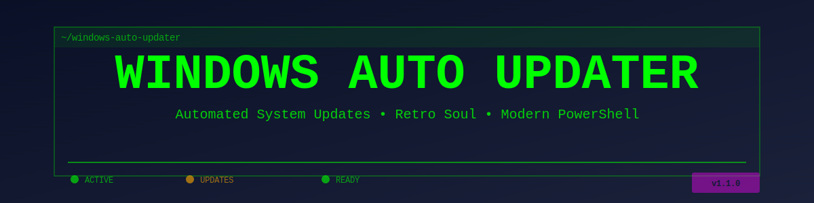

<p align="left">
  <picture>
    <source media="(prefers-color-scheme: dark)" srcset="assets/banner-dark.svg">
    <source media="(prefers-color-scheme: light)" srcset="assets/banner-light.svg">
    
  </picture>
</p>

# Windows Auto Updater

A modern automation tool with a retro soul — keep your Windows system and apps updated automatically with a small, configurable PowerShell utility.

[](https://github.com/thegeekyjay/windows-auto-updater/releases)
[](https://github.com/thegeekyjay/windows-auto-updater/actions)
[](https://github.com/thegeekyjay/windows-auto-updater/blob/main/LICENSE)
[](https://github.com/thegeekyjay/windows-auto-updater/commits/main)
[](https://github.com/PowerShell/PowerShell)

---

## Table of Contents

- [About](#about)
- [Features](#features)
- [Prerequisites](#prerequisites)
- [Installation](#installation)
- [Usage](#usage)
- [Configuration](#configuration)
- [Scheduling (Task Scheduler)](#scheduling-task-scheduler)
- [Logging & Troubleshooting](#logging--troubleshooting)
- [Branding](#branding)
- [Contributing](#contributing)
- [License](#license)
- [Acknowledgements](#acknowledgements)

---

## About

Windows Auto Updater automates common update tasks on Windows:

- Update winget packages
- Update Microsoft Store apps
- Install Windows Updates
- Verify system restore points
- Detect pending reboots
- Daily run check to prevent redundant executions
- Comprehensive error handling and recovery
- Timestamped logging and notifications
- Run unattended via Task Scheduler

It is built with modern PowerShell but ships with a playful retro-inspired branding — practical and fun.

---

## Features

- **Version 1.1** — Stable release with comprehensive automation
- **Fully automated winget package updates** with exit code validation
- **Automated Microsoft Store app updates** with availability checking (skips gracefully if unavailable)
- **Automated Windows Update installation** with reboot detection
- **System restore point verification** after updates
- **Daily run prevention** — automatically skips if already run today (bypass with `-Force`)
- **Comprehensive error handling** — try-catch-finally with proper cleanup
- **Module availability validation** — verifies PSWindowsUpdate and BurntToast before use
- **Log-Message helper function** — consistent color-coded output (Info/Warning/Error/Success)
- **Timestamped logging** to disk with automatic cleanup (logs older than 30 days deleted)
- **Toast notifications** on task completion with status indicator
- **Reboot status detection** — alerts when reboot is required
- **Administrator privilege check** — validates elevated privileges before proceeding with exit code 1 if not admin
- **Color-coded console output** (Cyan/Yellow/Red/Green) for easy issue identification
- **Smart error recovery** — continues processing if one update method fails; reports all warnings in summary
- **Designed to run under Task Scheduler** or as a one-off script
- **Graceful degradation** — missing optional modules/commands don't crash script

---

## Prerequisites

- Windows 10 / Windows 11
- PowerShell 5.1+ (PowerShell Core also supported where applicable)
- **Administrator privileges** (required for Windows Update and system operations)
- **winget** (App Installer) for package management
- **PSWindowsUpdate** PowerShell module (install with: `Install-Module -Name PSWindowsUpdate -Force`)
- **BurntToast** PowerShell module for notifications (install with: `Install-Module -Name BurntToast -Force`)
- Optional: Windows Store & Microsoft Store CLI for Store app updates

---

## Installation

1. Download or clone the repository:

   ```powershell
   git clone https://github.com/thegeekyjay/windows-auto-updater.git
   cd windows-auto-updater
   ```

2. Install required PowerShell modules (run in elevated PowerShell):

   ```powershell
   Install-Module -Name PSWindowsUpdate -Force
   Install-Module -Name BurntToast -Force
   ```

3. Ensure winget is installed:

   ```powershell
   winget --version
   ```
   If not installed, install App Installer from Microsoft Store.

4. Run the script as Administrator:

   ```powershell
   Start-Process -FilePath powershell -Verb runAs -ArgumentList '-NoProfile -ExecutionPolicy Bypass -File .\FullUpdate.ps1'
   ```

**Notes:**
- The script will automatically verify admin privileges and required modules on startup
- Missing modules will be reported with installation instructions
- If your environment restricts script execution, use `-ExecutionPolicy Bypass` or configure an appropriate execution policy

---

## Usage

Basic invocation:

```powershell
# Run updates (skips if already ran today)
.\FullUpdate.ps1

# Force run regardless of daily check
.\FullUpdate.ps1 -Force

# Get help and parameters
Get-Help .\FullUpdate.ps1 -Full
```

### Parameters

- **`-Force`** — Force execution even if script already ran today. Useful for manual/testing execution.

### Behavior

### Behavior & Resilience

- **Resilient Processing**: Script continues even if individual update methods fail
  - If winget fails: logs error, continues to Microsoft Store updates
  - If Store updates fail: logs error, continues to Windows Updates
  - If Windows Update fails: logs error, continues to verification steps
  - Each failure sets `$UpdatesFailed` flag for final status reporting

- **State File Handling**: If state file cannot be written, script logs warning and continues
  - Allows execution to proceed even if state tracking fails
  - Missing state file on subsequent runs will re-execute (not skip)

- **Module Handling**: Missing optional modules are reported with installation instructions
  - PSWindowsUpdate missing: Windows updates skipped, others continue
  - BurntToast missing: Script continues, notifications skipped
  - Script never crashes due to missing modules

- **Final Status**: Summary shows "COMPLETED SUCCESSFULLY" only if all steps succeeded
  - Shows "COMPLETED WITH WARNINGS/ERRORS" if reboot required or any step failed
  - Updates not performed if daily skip check triggered (shows "No further action required")

---

## Configuration

The script uses hardcoded paths that can be modified directly in the script:

```powershell
# State directory (daily run tracking)
$StateDir = "C:\Scripts\State"

# Log directory (update logs and transcripts)
$LogDir = "C:\Scripts\Logs"
```

To customize these paths, edit `FullUpdate.ps1` and update the variables in the "Logging Setup" section (around line 120).

### Helper Functions

The script includes two helper functions for consistency and maintainability:

**`Ensure-ModuleAvailable`** (line 45)
- Validates PowerShell module availability
- Provides installation instructions if module not found
- Returns `$true` if available, `$false` if missing
- Used for: PSWindowsUpdate, BurntToast

**`Log-Message`** (line 58)
- Unified logging with color-coding and timestamps
- Parameters:
  - `$Message`: Text to output
  - `$Level`: Info (Cyan) | Warning (Yellow) | Error (Red) | Success (Green)
  - `-NoTimestamp`: Omit timestamp (optional)
- Used throughout script for consistent output

### Logging

- **Location**: `C:\Scripts\Logs\UpdateLog-[DATE].txt` (default)
- **Transcript**: Full PowerShell transcript appended to daily log
- **Cleanup**: Logs older than 30 days are automatically deleted
- **Timestamp Format**: `dd-MMM-yy` for files, `HH:mm:ss` for console/log entries
- **State Tracking**: Last run date stored in `C:\Scripts\State\LastRun.txt`

### Summary Output

After updates complete, a summary is displayed showing:
- Winget update status with exit code (if non-zero)
- Microsoft Store update status (or SKIPPED if store command unavailable)
- Windows Update installation status (or SKIPPED if module unavailable)
- Restore point verification result
- Reboot status (required/not required/unable to determine)
- Overall completion status (success/warnings/errors) in color-coded output

---

## Scheduling (Task Scheduler)

To automate runs, create a scheduled task that runs as SYSTEM or an administrative user.

### Basic Setup

Example: register a scheduled task that runs daily at 3:00 AM with highest privileges:

```powershell
$taskName = "Windows Auto Updater"
$scriptPath = "C:\path\to\FullUpdate.ps1"

$action = New-ScheduledTaskAction `
  -Execute "PowerShell.exe" `
  -Argument "-NoProfile -ExecutionPolicy Bypass -File '$scriptPath'"

$trigger = New-ScheduledTaskTrigger -Daily -At 3am

$principal = New-ScheduledTaskPrincipal `
  -UserId "SYSTEM" `
  -RunLevel Highest

Register-ScheduledTask `
  -TaskName $taskName `
  -Action $action `
  -Trigger $trigger `
  -Principal $principal
```

### With Force Parameter

To bypass the daily skip check (useful for testing):

```powershell
$action = New-ScheduledTaskAction `
  -Execute "PowerShell.exe" `
  -Argument "-NoProfile -ExecutionPolicy Bypass -File '$scriptPath' -Force"
```

### Important Notes

- **Admin Requirement**: Task must run as SYSTEM or an account with Administrator privileges
  - The script validates admin rights at startup and exits with exit code 1 if not elevated
  - SYSTEM account is recommended for unattended execution
  
- **Daily Skip Check**: Script automatically prevents duplicate runs if scheduled multiple times per day
  - Use `-Force` parameter to override this check
  
- **Log Files**: Output is logged to:
  - `C:\Scripts\Logs\UpdateLog-[DATE].txt` (daily transcript)
  - `C:\Scripts\State\LastRun.txt` (last execution date)
  - Logs older than 30 days are automatically deleted

- **Error Handling**: Script fails gracefully with proper error messages in logs
  - Check `C:\Scripts\Logs\` for troubleshooting details
  - Non-zero exit codes indicate failures

### Via Task Scheduler GUI

Alternatively, create the task using the GUI:
1. Open Task Scheduler
2. Create Basic Task
3. Set trigger (Daily, 3:00 AM)
4. Set action to run: `PowerShell.exe`
5. Arguments: `-NoProfile -ExecutionPolicy Bypass -File "C:\path\to\FullUpdate.ps1"`
6. Set principal to run with highest privileges
7. Configure account: SYSTEM or administrator account

---

## Logging & Troubleshooting

### Log Locations

- **Logs**: `C:\Scripts\Logs\UpdateLog-[DATE].txt`
- **State**: `C:\Scripts\State\LastRun.txt` (tracks last execution date)
- **Transcript**: Appended to daily log file

### Common Issues & Solutions

| Issue | Cause | Solution |
|-------|-------|----------|
| "Must run with Administrator privileges" | Script running as non-admin user | Run PowerShell as Administrator |
| "PSWindowsUpdate module not installed" | Missing required module | Run `Install-Module -Name PSWindowsUpdate -Force` |
| "BurntToast module not installed" | Missing notification module | Run `Install-Module -Name BurntToast -Force` (optional) |
| "'store' command not found" | Microsoft Store CLI unavailable | Install App Installer or update Windows |
| Script runs twice | Scheduled task runs multiple times daily | Use daily skip check or adjust schedule |
| Windows Update install fails | Module/permission issues | Check transcript for detailed error; rerun manually to diagnose |

### Troubleshooting Steps

1. **Check the log file**: Look in `C:\Scripts\Logs\` for the most recent log
2. **Review error messages**: Error messages are color-coded (red) in console output
3. **Test with Force flag**: Run `.\FullUpdate.ps1 -Force` to bypass daily check
4. **Run manually**: Execute script manually in elevated PowerShell to see real-time output
5. **Check prerequisites**: Verify winget, PSWindowsUpdate, and BurntToast are installed
6. **Review transcript**: Full PowerShell transcript is included in log file with detailed cmdlet output

---

## FAQ

**Q: Will this reboot my machine?**
A: Only if Windows Updates require a reboot. The script detects pending reboot status via Windows registry (`HKLM:\Software\Microsoft\Windows\CurrentVersion\WindowsUpdate\Auto Update\`) and reports it in the summary with status "REQUIRED". When reboot is needed, `$UpdatesFailed` is set to true and the final status shows "COMPLETED WITH WARNINGS/ERRORS". The PSWindowsUpdate module's `-AutoReboot` flag may trigger automatic reboot if configured by the module.

**Q: Why does the script skip when I run it multiple times?**
A: The daily skip check prevents redundant executions if the script already ran today. Use `-Force` parameter to override this check for testing.

**Q: What if required modules are missing?**
A: The script checks for PSWindowsUpdate and BurntToast at startup and displays installation instructions if missing. The script will skip updates but won't crash.

**Q: Can I customize the log/state directories?**
A: Yes — edit the `$StateDir` and `$LogDir` variables in the script to point to your preferred locations.

**Q: Does this work with Windows 10/11?**
A: Yes, both are supported. You need PowerShell 5.1+ and administrator privileges.

**Q: What if the script runs during a reboot?**
A: The finally block ensures proper cleanup (stopping transcript, sending notification) even if rebooting occurs.

**Q: How do I see detailed output?**
A: Logs are written to `C:\Scripts\Logs\UpdateLog-[DATE].txt`. Open the most recent log to see full transcript and timestamps.

**Q: Can I deploy this to multiple machines?**
A: Yes — copy the script to each machine and create a scheduled task, or use Group Policy/Intune for enterprise deployment.

---

## Branding

This project includes retro-inspired banners in both dark and light themes to match your GitHub preferences.

### Banner Usage

The README automatically displays the appropriate banner based on your GitHub theme preference:
- **Dark Theme** (`banner-dark.svg`) — Neon green terminal aesthetic on dark background
- **Light Theme** (`banner-light.svg`) — Professional dark text on light background

Both banners are scalable SVG files located in the `/assets` directory.

### Customization

To use a specific banner in your own documentation:

```markdown
<!-- Dark theme (retro neon green) -->


<!-- Light theme (professional) -->

```

---

## Contributing

Contributions are welcome! A suggested workflow:

1. Fork the repo
2. Create a feature branch
3. Open a PR with a clear description and tests (if applicable)
4. Follow existing coding style and include documentation updates for behavioral changes

Please open issues for bugs or feature requests and tag them appropriately.

---

## License

This project is licensed under the MIT License — see the [LICENSE](https://github.com/thegeekyjay/windows-auto-updater/blob/main/LICENSE) file for details.

---

## Acknowledgements

- Built with PowerShell
- Thanks to the winget and App Installer teams
- Retro-inspired artwork and badges by the project author

---

Changelog and release notes are available on the [releases page](https://github.com/thegeekyjay/windows-auto-updater/releases).
