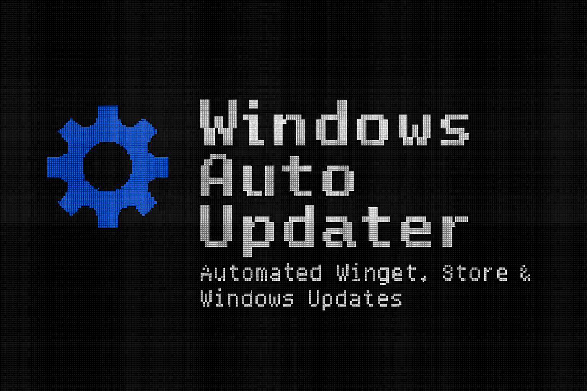

  

<h1 align="left">Windows Auto Updater</h1>

A modern automation tool with a retro soul — keeping your system updated without lifting a finger.

  <!-- Retro Version Badge -->
  <!-- img src="assets/badge-v1.png" width="110" alt="Retro Version Badge" />

  <!-- Modern Shields.io Badges -->
  
  
  
  
  

## 🚀 Features

- Fully automated **Winget** package updates  
- Automated **Microsoft Store** app updates  
- Automated **Windows Update** installation  
- Clean logging and error handling  
- Designed for **Task Scheduler** automation  
- Retro‑inspired branding for fun, modern PowerShell under the hood  
