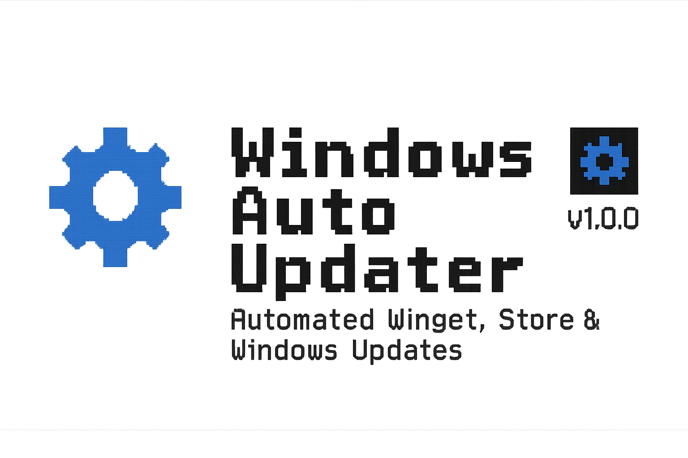

  

  

  

  
  
  
  
  

# Windows Auto Updater (Winget + Store + Windows Update)

This project provides a fully automated Windows update system using PowerShell and Task Scheduler.  
It updates:

- Winget packages  
- Microsoft Store apps  
- Windows Updates  
- Logs everything  
- Sends toast notifications (BurntToast)  
- Skips automatically if already run today  

See `FullUpdate.ps1` for the full script.
